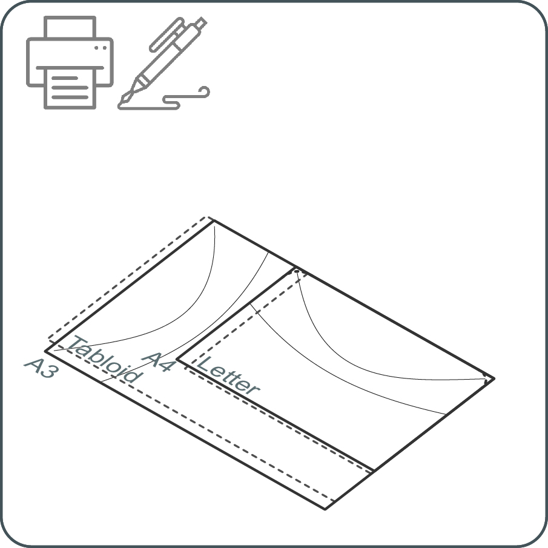
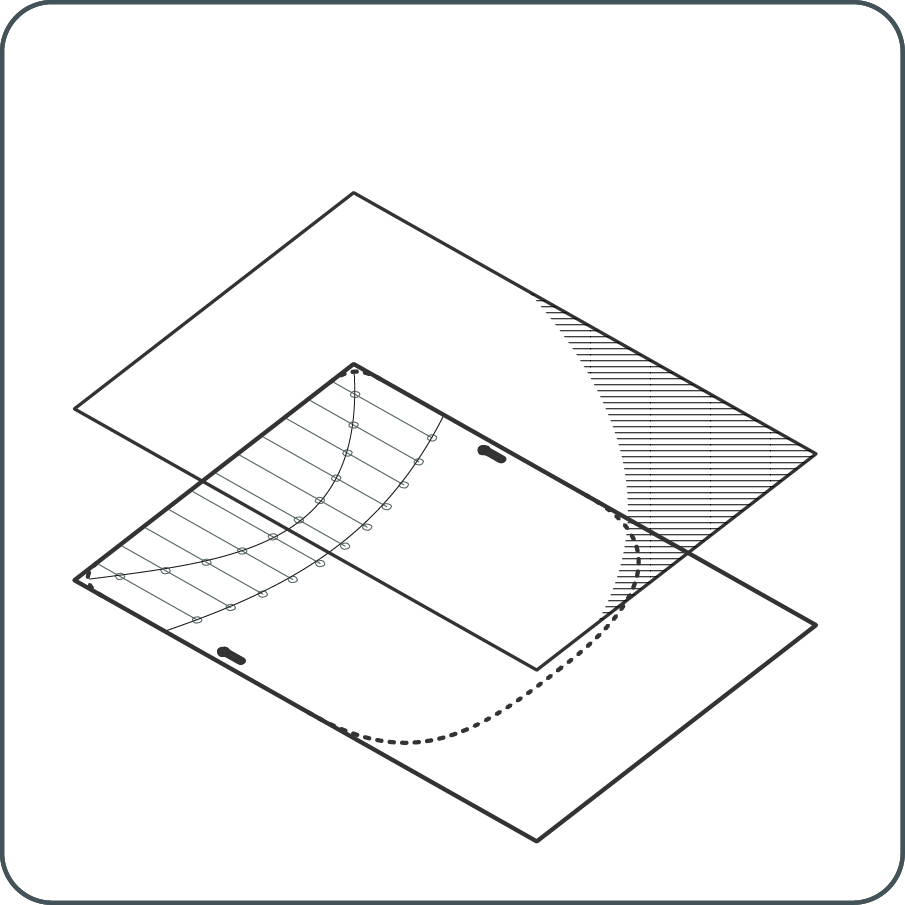
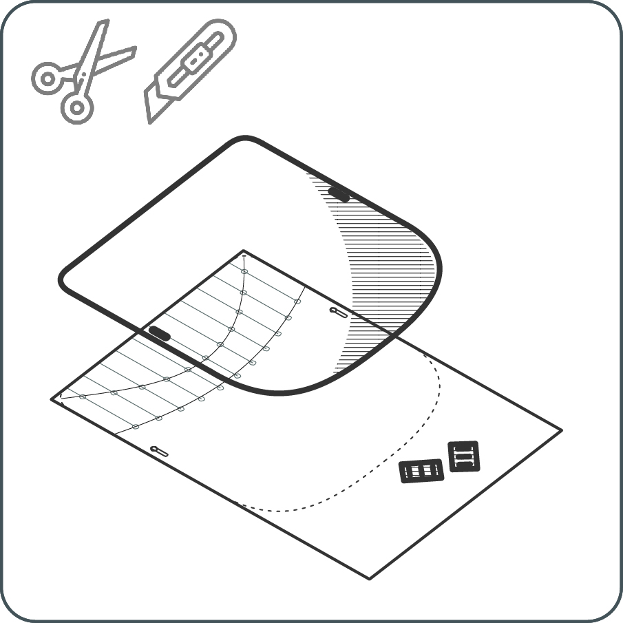
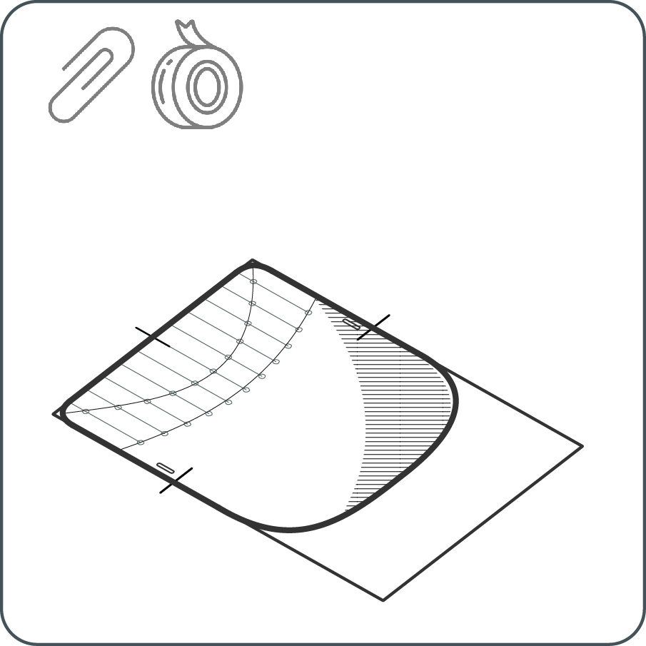
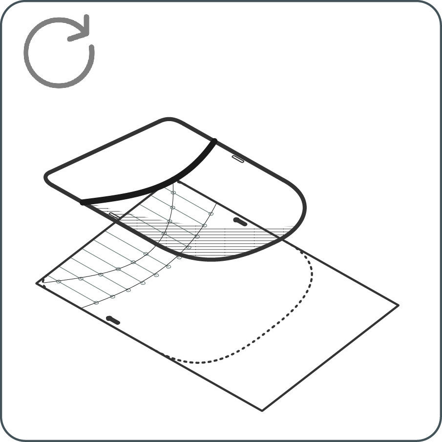
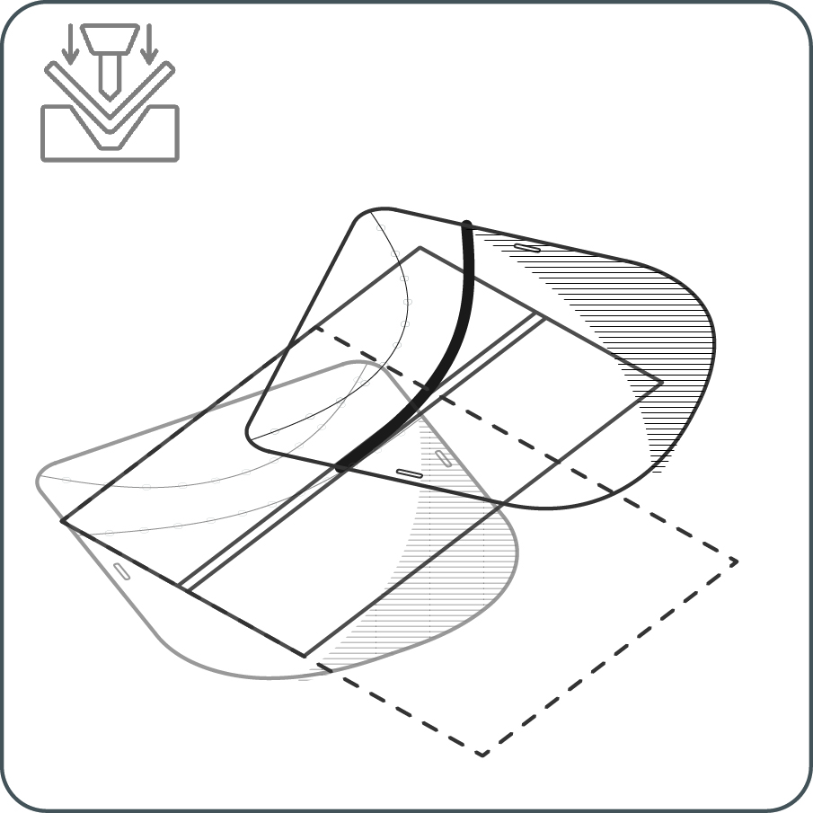
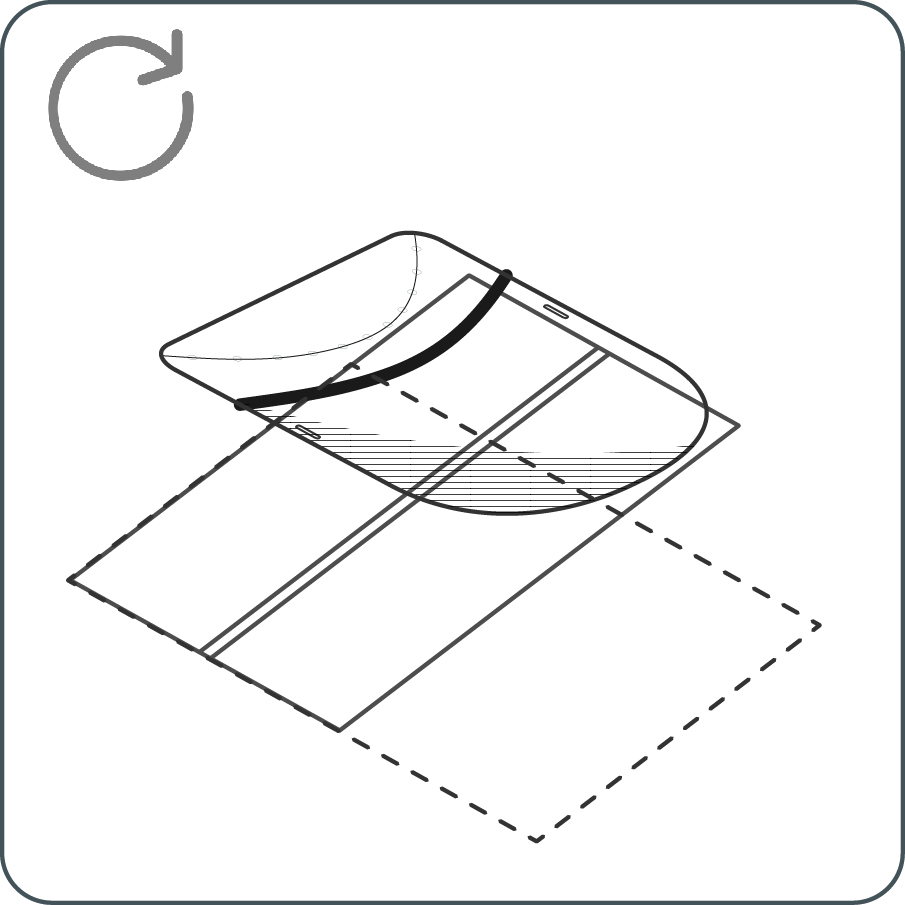
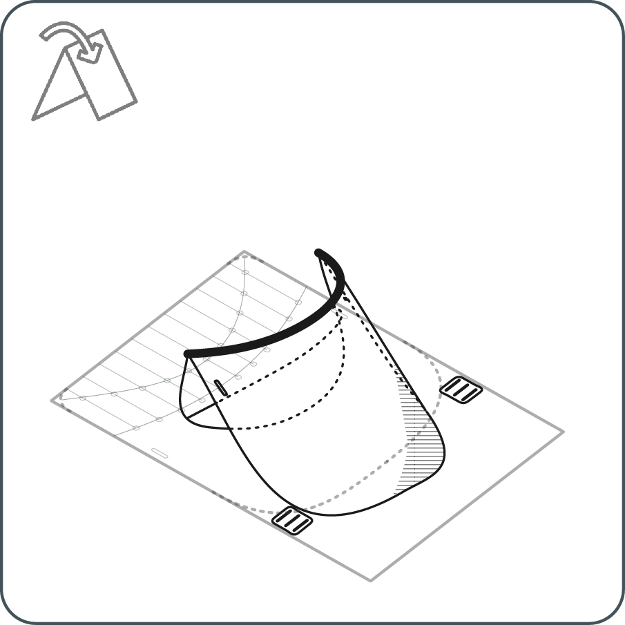
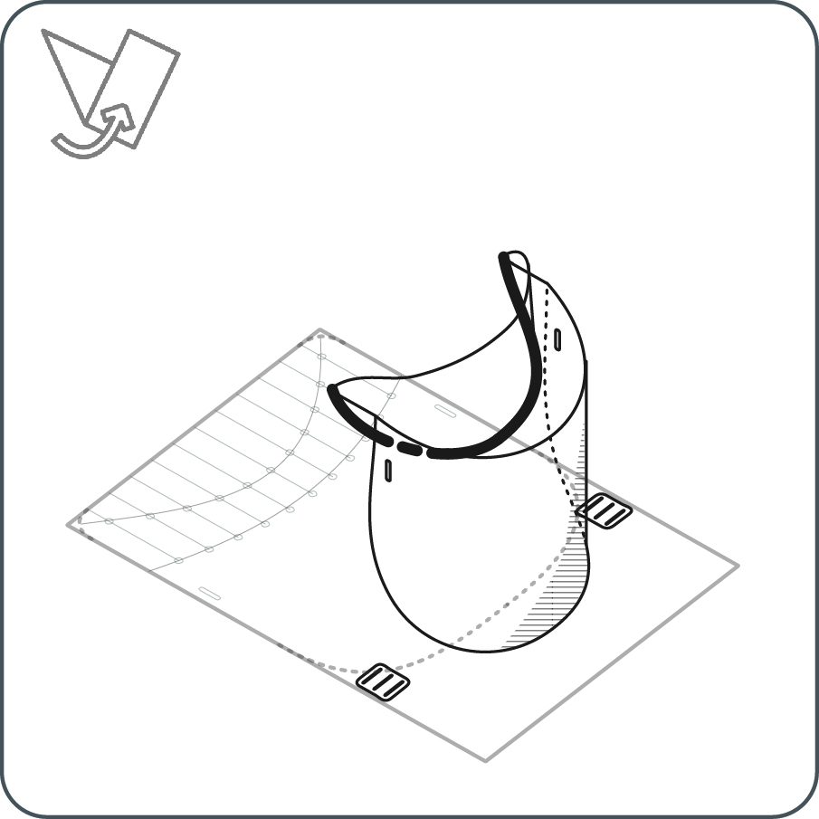

<i class="em em-timer_clock" aria-role="presentation" aria-label=""></i>: 10-15′

---

<iframe src="https://snapwidget.com/embed/810064" class="snapwidget-widget" allowtransparency="true" frameborder="0" scrolling="no" style="border:none; overflow:hidden;  width:100%; "></iframe>

---

---

## Aviso Legal

---

A Universidade de Cambrigde (UC) e a Universidade de Queensland (UQ) não fazem qualquer garantia, expressa ou implícita, sobre o design, características, durabilidade, uso e desempenho do HappyShield, incluindo mas não limitado às garantias implícitas da sua comercialização e aplicação para qualquer uso particular. O HappyShield está desenhado para minimizar a exposição a fluídos e sprays, mas a UC e a UQ não garantem que o HappyShield proteja os seus utilizadores da infeção por COVID-19 ou qualquer outra doença infeciosa. Nada nestas instruções constitui conselhos médicos, e os utilizadores devem procurar o seus próprios conselhos médicos sobre se o HappyShield é adequado para o uso pretendido, e se o devem utilizar em conjunto com outros dispositivos médicos e estratégias. Na extensão mais completa da lei, a UC e a UQ excluem todas as garantias implícitas, garantias, termos e condições. A UC e a UQ não se responsabilizam por quaisquer queixas, reivindicações, estragos ou acidentes, incluindo mas não limitado a estragos materiais, danos físicos ou doenças, morte, “Reclamações” indiretas, específicas ou consequenciais da utilização do HappyShield, e os utilizadores do HappyShield ilibam a UC e a UQ e os seus administradores, empregados, contratos e agentes de todas as reivindicações.

---

--- 

## Ferramentas

---

* Tesoura ou lâmina de corte
* Caneta esferográfica
* Régua
* Faca de manteiga
* Impressora

---

## Materiais

---

**Viseira**

* Polietileno tereftalato (PET) com 0,5 mm de espessura ou como alternativa uma folha de acetato 
* Fita elástica larga de 20 mm (70% poliéster 30% borracha)
* Fita adesiva

---

---

# Instruções

---

# 1 

Descarrege o modelo de vinco. Modelos de tamanho A4 estão disponíveis para viseiras de tamanho A3. Modelos de tamanho "tipo carta" estão disponíveis para viseiras de tamanho "tipo tablóide". Se não tiver acesso a uma impressora, pode desenhar o seu próprio modelo usando as dimensões ilustradas acima.

---

# 2

Coloque a folha transparente em cima do modelo. Marque a localização dos furos de cinta com a caneta ou marcador. Não se preocupe com a tinta, pode ser removida posteriormente com um pano embebido em álcool.  

---

# 3

Trace os limites da viseira para cortar. 

---

# 4

Corte os limites da viseira usando a tesoura ou a lâmina de corte. Corte os furos de cinta. Também pode usar um furador para fazer estes furos. 

Em seguida, corte os clipes de fricção usando a lâmina de corte.

Agora, vamos desenhar um sorriso!

---

## Método de Decalque A

---

# 5A

Coloque a folha transparente em cima do modelo. Fixe com clips ou fita adesiva para um traçado mais preciso.

---

# 6A

Usando a régua, e aplicando pressão, vinque as linhas entre cada ponto consecutivo, usando 2-3 golpes até ser visível um vinco na folha.

---

# 7A

Vire a folha transparente.  Fixe a folha e o modelo novamente.

---

# 8A

Trace a segunda curva da mesma forma que no passo **6A**.

---

## Método de Decalque B

---

# 5B	

Trace as curvas dobráveis com a caneta (aqui não é necessária pressão adicional). Se desejar, fixe a folha ao modelo com clipes ou fita adesiva para um traçado mais preciso.

---

# 6B

Encontre uma ranhura de 2-5 mm de largura, 2-3 mm de profundidade e pelo menos 5 cm de comprimento numa superfície imóvel ou mesa de trabalho. Ranhuras entre tábuas de chão, segmentos de uma mesa de jantar ou balcão de cozinha funcionam bem para este método. Alternativamente, faça a sua prórpia ranhura num pedaço de madeira ou outro material. Em seguida, utilize a caneta esferográfica ou outra ferramenta com uma ponta não cortante (faca de manteiga, colher ou pauzinho de comida chinesa podem resultar também). 

Usando uma mão mova a folha como se tratasse de um pedaço de tecido numa máquina de costura, use a outra mão para repetidamente percorrer a ferramenta de vinco sobre a superfície do material ao longo da ranhura, seguindo uma das curvas dobráveis que traçou.

---

# 7B

Vire a folha ao contrário.

---

# 8B

Repida o passo 6B para a outra curva dobrável.

---

# 9

Começando numa ponta da curva dobrável, e lentamente até à outra ponta, aperte gentilmente a folha para a dobrar ao longo da curva. Se alguns segmentos não dobrarem fácilmente, repita o precesso de vinco. 

---

# 10

Repita o passo 9 para a outra curva, mas desta vez, dobre a folha na direção contrária. 

---

# 11	

Passe o elástico pelos clipes de fricção. Passe os clipes de fricção pelos orifífios na viseira de trás para a frente.

