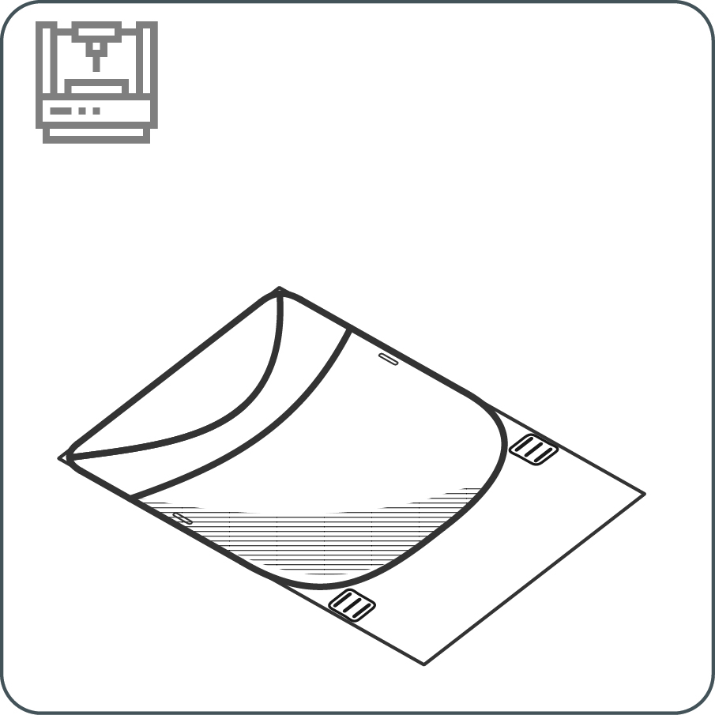
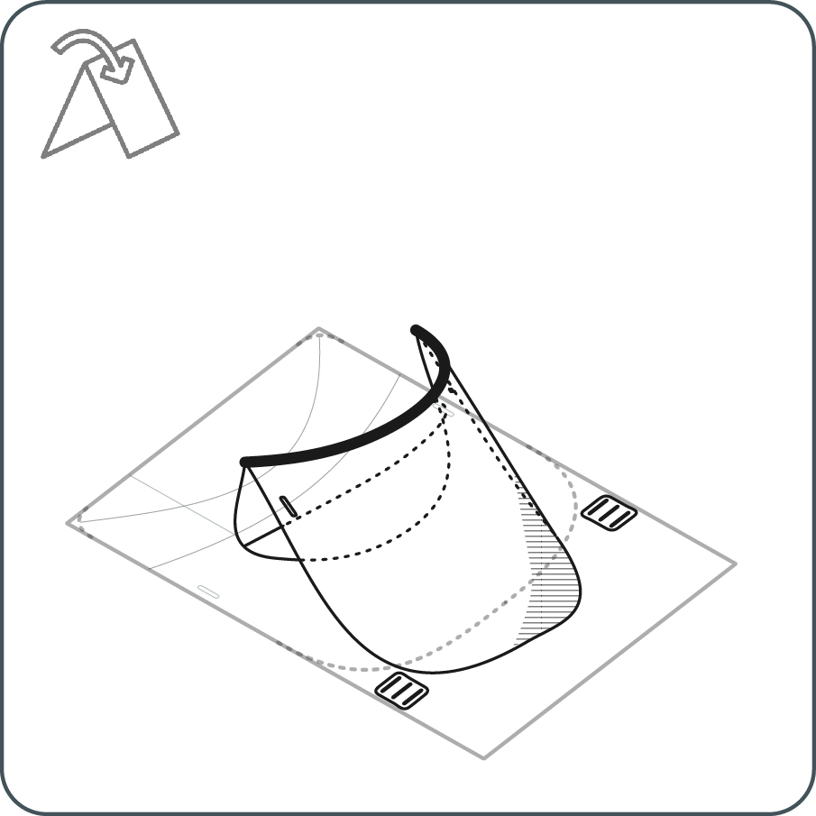
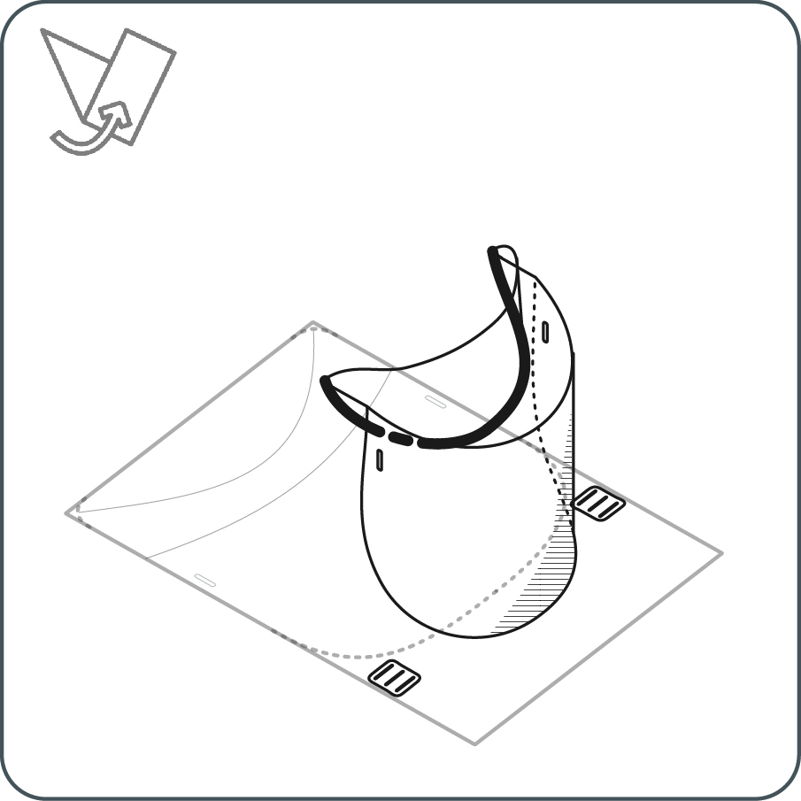
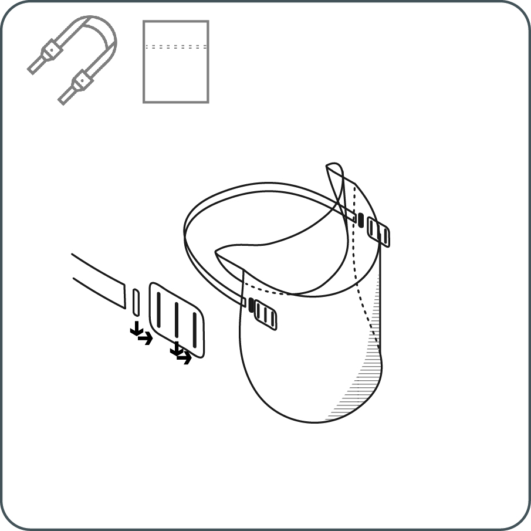

---
layout: page
title: القص بالليزر 
tagline: &nbsp <a href = "https://github.com/HappyShield/HappyShield/tree/master/Templates/LaserCut" ><i class="em em-triangular_ruler" aria-role="presentation" aria-label="TRIANGULAR RULER"></i></a>
permalink: /laser-cut/ar/
language: ar
dir: rtl
---

<iframe src="https://snapwidget.com/embed/811086" class="snapwidget-widget" allowtransparency="true" frameborder="0" scrolling="no" style="border:none; overflow:hidden;  width:100%; "></iframe>

---

## إخلاء مسؤولية (Disclaimer)

---

The University of Cambridge (UC) and the University of Queensland (UQ) make no warranty of any kind, express or implied, about the design, characteristics, durability, proper use or performance of the HappyShield, including but not limited to implied warranties of merchantability and fitness for any particular purpose. The HappyShield is designed to minimise exposure to fluids and sprays, but UC and UQ do not warrant that HappyShield will protect users from COVID-19 infection or any other infectious disease. Nothing in this material constitutes medical advice, and users should seek their own medical advice about whether HappyShield is suitable for the use they intend, and whether they should use it in conjunction with any other medical or other strategies. To the fullest extent allowed by law, UC and UQ exclude all implied warranties, guarantees, terms and conditions. UC and UQ are not liable for any claims, demands, damages or injuries, including but not limited to property damage, bodily injury or illness, death, indirect, special or consequential damages (“the Claims”) arising out of using the HappyShield, and users of HappyShield release UC and UQ and their officers, employees, contractors and agents from all Claims.

---

---

## الادوات
---

* قاطع ليزري
* مقص او مشرط

---

## المواد

---

**غطاء الوجه**

* نصف مم سماكة لوح بت البولي ايثيلين تيريفثاليت,  أو لوح شفاف اسيتات
* شريط مطاطي بعرض 20 مم . 70 بوليستر 30٪ مطاط

---

---

# التعليمات

---

# 1

قم بتنزيل مخطط قص الليزر من موقعنا.  قم بقص اللوح البلاستيكي الشفاف باستخدام بالليزر ، تأكد أن إعدادات طاقة وسرعة القاطع بالليزر مناسبة لعمق ونوع المادة. 

---

# 2	

قم بطي الغطاء, ابدأ من نهاية منحني الحز, اصغط برفق على طرفي الغطاء وقم بالطي حتى النهاية الاخرى للمنحني 

--- 

# 3 	

كرر الخطوة 9 لمنحنى الحز الآخر ، ولكن هذه المرة ، قم بطي الورقة في الاتجاه الآخر

---

# 4	

مرر الشريط من خلال مستطيلات التثبيت. مرر المستطيلات عبر الفتحات الموجودة في غطاء من الجانب الخلفي إلى الأمام.

