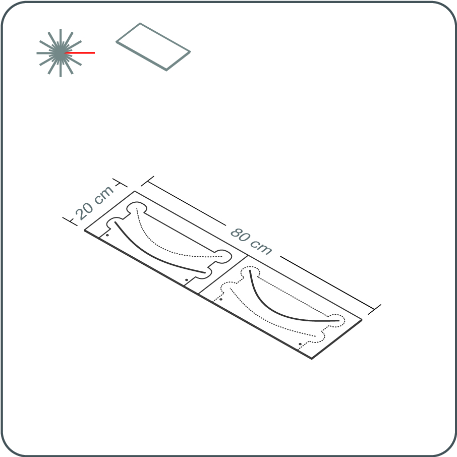

<iframe src="https://snapwidget.com/embed/810066" class="snapwidget-widget" allowtransparency="true" frameborder="0" scrolling="no" style="border:none; overflow:hidden;  width:100%; "></iframe>

---

## Disclaimer

---

The University of Cambridge (UC) and the University of Queensland (UQ) make no warranty of any kind, express or implied, about the design, characteristics, durability, proper use or performance of the HappyShield, including but not limited to implied warranties of merchantability and fitness for any particular purpose. The HappyShield is designed to minimise exposure to fluids and sprays, but UC and UQ do not warrant that HappyShield will protect users from COVID-19 infection or any other infectious disease. Nothing in this material constitutes medical advice, and users should seek their own medical advice about whether HappyShield is suitable for the use they intend, and whether they should use it in conjunction with any other medical or other strategies. To the fullest extent allowed by law, UC and UQ exclude all implied warranties, guarantees, terms and conditions. UC and UQ are not liable for any claims, demands, damages or injuries, including but not limited to property damage, bodily injury or illness, death, indirect, special or consequential damages (“the Claims”) arising out of using the HappyShield, and users of HappyShield release UC and UQ and their officers, employees, contractors and agents from all Claims.

---

--- 

## เครื่องมือ

---

* เครื่องตัดเลเซอร์
* เครื่องกดขนาด 10 ตัน
* คีมสามารถตัดลวดสลิงเหล็กขนาด 1 มม.
* กรรไกรหรือใบมีดโกน
* สว่านหรือไขควง

---

## วัสดุ

---

**จิ๊กกด 3 ส่วน**

* 4 มม. MDF
* เชือกลวดเหล็กขนาด 1 มม
* สกรูไม้ขนาด 6-20 มม
* เทปพลาสติกใส

**หน้ากาก**

* แผ่นพลาสติกใส Polyethylene terephthalate (PET) หรือแผ่นอะซิเตท หนาอย่างน้อย 0.5 มิลลิเมตร
* สายยางยืดถักกว้าง 20 มม. (70% โพลีเอสเตอร์ 30% ยาง)

---

---

# คำแนะนำ

---

## จิ๊กกด 3 ส่วน

---

# 1 	

ดาวน์โหลดเทมเพลตการตัดด้วยเลเซอร์สำหรับจิ๊กกด 3 ส่วนที่พอดีกับแท่นของเครื่องตัดเลเซอร์ของคุณ (ขนาดของแม่แบบการตัดจะได้รับในชื่อไฟล์) เลเซอร์ตัด MDF โดยใช้ไฟล์แม่แบบ

---

# 2

เอาจิ๊กกด 3 ส่วนออกจากเครื่องตัดเลเซอร์ ตัดลวดสลิงตามความยาวของเส้นโค้งประที่อยู่ในส่วน A และ C ของแม่แบบ

ติดเทปลวดโลหะลงบนเส้นประที่ร่องของชิ้นส่วน A และ C ของจิ๊กกด ตรวจสอบให้แน่ใจว่าไม่เบี่ยงเบนไปจากเส้นโค้งประและไม่ขยายเกินปลายของเส้นประ

---

# 3

ต่อส่วน B ด้านบน A โดยใช้สกรูไม้สั้น แนบส่วน A และ B ที่รวมกันเข้ากับบล็อกตามต้องการเพื่อกระจายแรงกดให้ทั่วพื้นผิวจิ๊ก ทำเช่นเดียวกันสำหรับส่วน C

--- 

## หน้ากาก

---

# 1

ดาวน์โหลดเทมเพลตการตัดด้วยเลเซอร์ HappyShield ที่พอดีกับแท่นของเครื่องตัดเลเซอร์ของคุณ (ขนาดของแม่แบบตัดจะได้รับในชื่อไฟล์)

---

# 2	

เลเซอร์ตัดวัสดุแผ่นพลาสติกใสโดยใช้ไฟล์แม่แบบต้องแน่ใจว่าเครื่องตัดเลเซอร์และความเร็วที่ใช้ต้องสามารถตัดผ่านความลึกของวัสดุได้อย่างดี

เมื่อตัดเสร็จแล้วให้นำหน้ากากและคลิปหนีบออกจากแท่นเครื่องตัดเลเซอร์ สามารถเช็ดขอบหน้ากากและคลิปหนีบด้วยแอลกอฮอล์หรือล้างด้วยสบู่ใด ๆ เพื่อกำจัดสิ่งตกค้างที่ตัดด้วยเลเซอร์ออกจากแผ่น

--- 

# 3

ใส่หน้ากากเข้าไปในจิ๊กกด 3 ส่วนแล้วกดเพื่อสร้างรอยพับโค้ง

---

# 4	

ตัดสายยางยืดที่มีความยาว 400 มม. ร้อยสายรัดผ่านคลิปหนีบที่ปลายทั้งสอง

---

# 5	

เสียบคลิปหนีบแบบเกลียวเข้าไปในรูในของหน้ากากจากด้านหลังไปด้านหน้า
