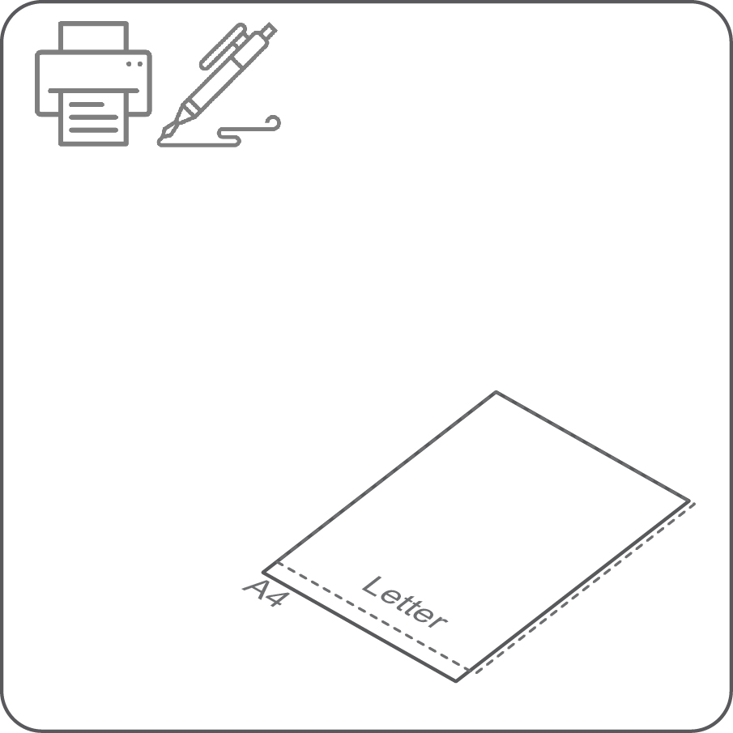
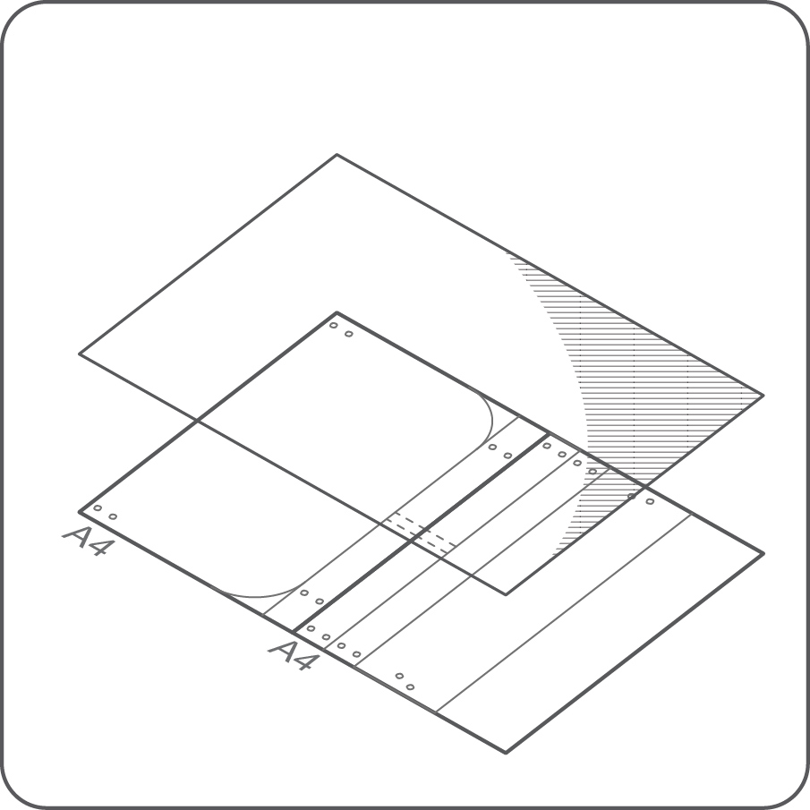
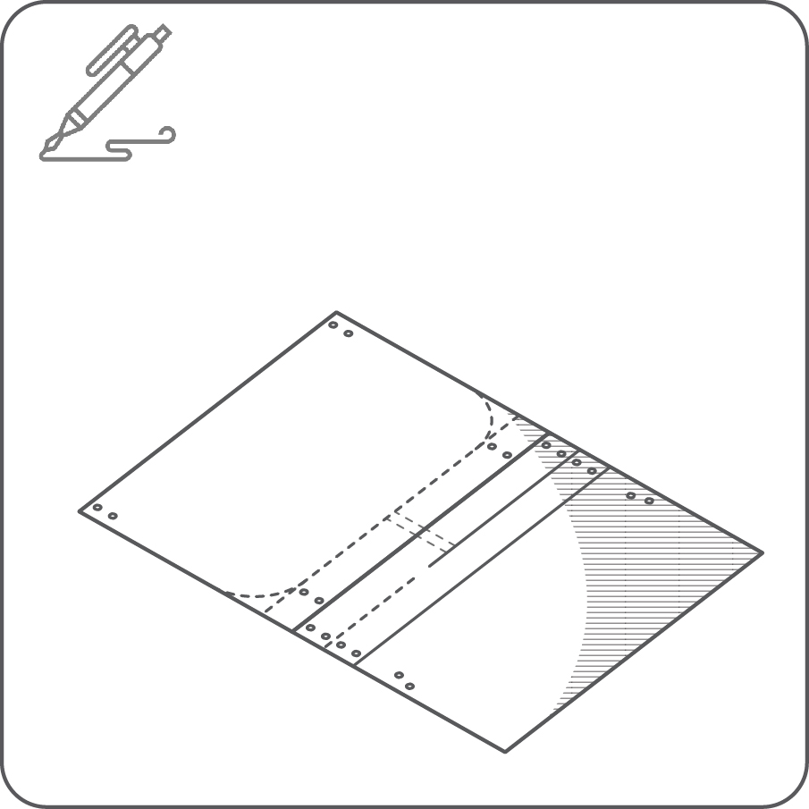
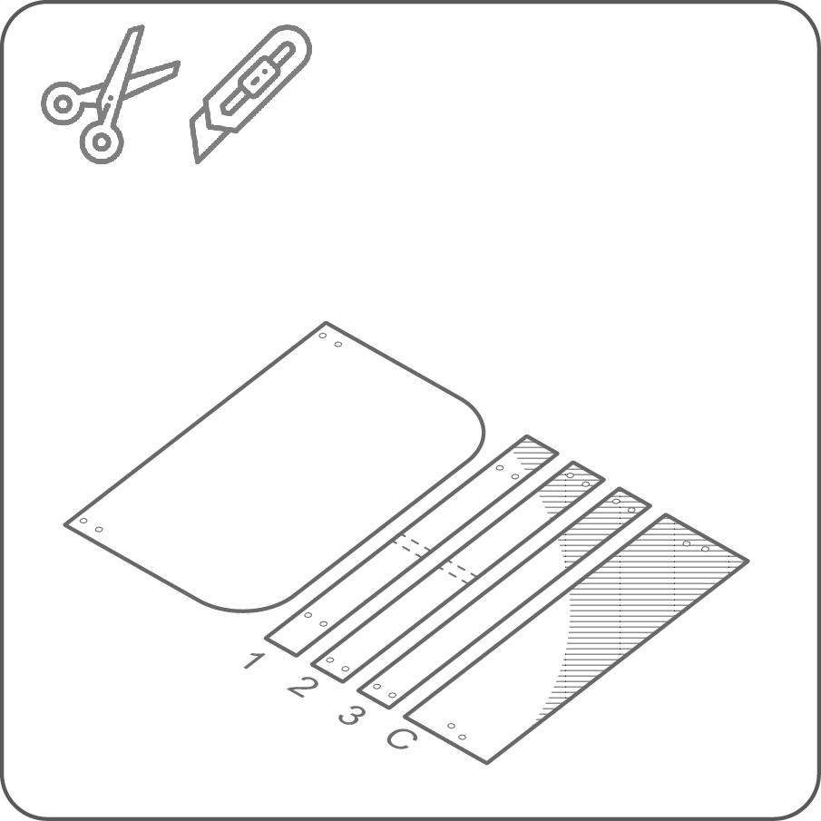
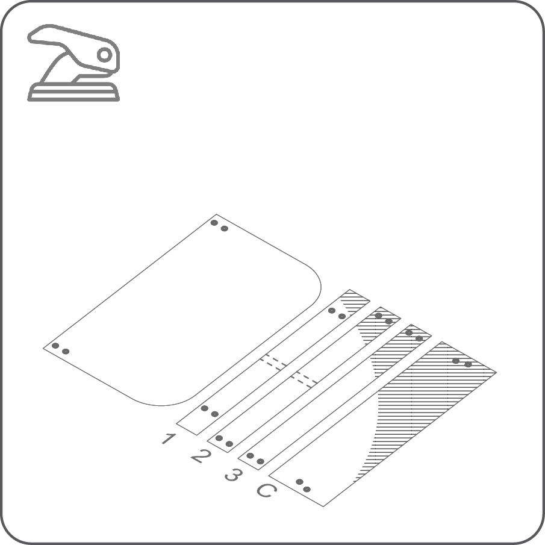
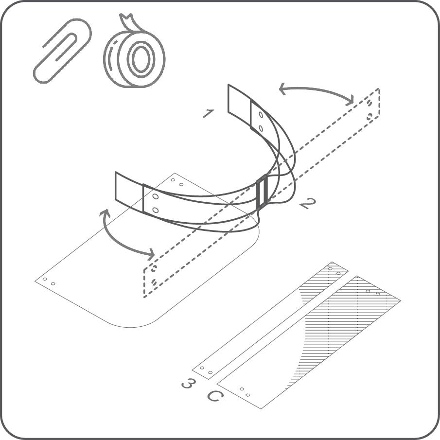
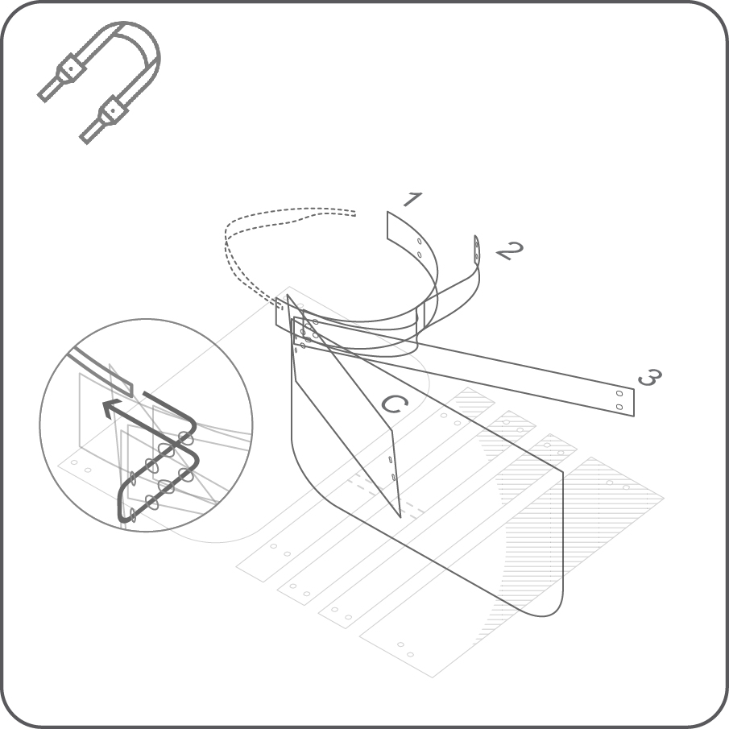
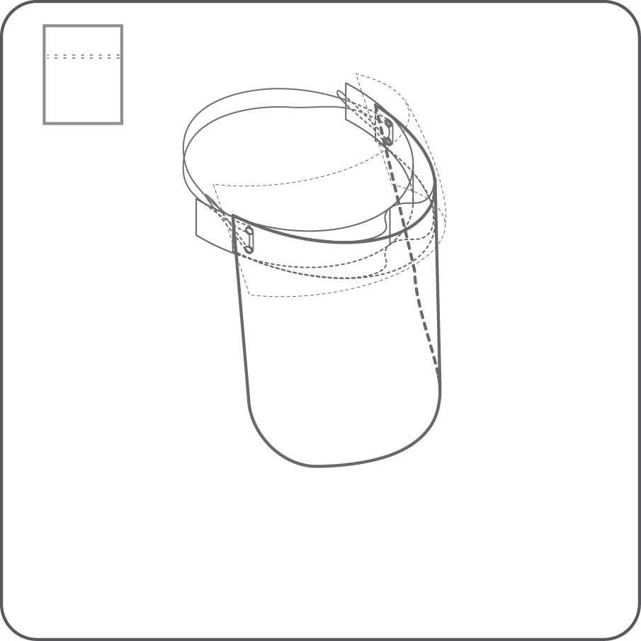

---
layout: page
title: WaveSHIELD
tagline: 
permalink: /wave-shield/ar/
language: ar
dir: rtl
---

<i class="em em-timer_clock" aria-role="presentation" aria-label=""></i>: 10-15′

---

---

## إخلاء مسؤولية (Disclaimer)

---

The University of Cambridge (UC) and the University of Queensland (UQ) make no warranty of any kind, express or implied, about the design, characteristics, durability, proper use or performance of the HappyShield, including but not limited to implied warranties of merchantability and fitness for any particular purpose. The HappyShield is designed to minimise exposure to fluids and sprays, but UC and UQ do not warrant that HappyShield will protect users from COVID-19 infection or any other infectious disease. Nothing in this material constitutes medical advice, and users should seek their own medical advice about whether HappyShield is suitable for the use they intend, and whether they should use it in conjunction with any other medical or other strategies. To the fullest extent allowed by law, UC and UQ exclude all implied warranties, guarantees, terms and conditions. UC and UQ are not liable for any claims, demands, damages or injuries, including but not limited to property damage, bodily injury or illness, death, indirect, special or consequential damages (“the Claims”) arising out of using the HappyShield, and users of HappyShield release UC and UQ and their officers, employees, contractors and agents from all Claims.

---

--- 

## الادوات

---

* مقص أو مشرط
* قلم حبر جاف

---

## المواد

---

**غطاء الوجه**

* نصف مم سماكة لوح بت البولي ايثيلين تيريفثاليت,  أو لوح شفاف اسيتات
* شريط مطاطي بعرض 20 مم . 70 بوليستر 30٪ مطاط
* شريط لاصق

---

---

# التعليمات

---

# 1 

قم بتحميل المخطط الخاص بغطاء الوجه من موقعنا.  إذا لم تتمكن من الوصول إلى طابعة ، يمكنك رسم المخطط الخاص بك باستخدام الأبعاد الموضحة في الرسمات المذكورة.

---

# 2

ضع الورقة الشفافة على المخطط. وثبتها 

---

# 3

ضع علامة على موقع الثقوب بقلم حبر جاف. لا تقلق بشأن الحبر ، يمكن إزالته بقطعة قماش مبللة بالكحول. ضع علامة على الخطوط والزوايا السفلية لقصها لاحقاً.

---

# 4

باستخدام المقص أو المشرط قم بقطع الالواح وتقليم زوايا الغطاء. سيتنج لديك خمس اواح 

---

# 5

قم بقطع الثقوب. يمكنك استخدام مثقب الورق أو الجلد إذا كان لديك.

---

# 6

ثبت بالشريط اللاصق اللوحين 1 و 2. تحقق من الشكل المشابه للموجة للوحين عند محاذاة الثقوب فيها. يجب أن يكون هذا الشكل متناظر قد الامكان.

---

# 7

ثبت بيدك كل الالواح مع بعضها. الترتيب من الداخل إلى الخارج: 1 ثم 2 ثم 3 ثم غطاء الوجه ثم الغطاء اعلوي. قم بمحاذاة الثقوب معًا. اربط الالواح بشريط مطاطي. يجب أن يدخل من الثقوب في المنطقة العلوية ويخرج من الثقوب في المنطقة السفلية.

---

# 8

كرر في الجانب المقابل. 

---

