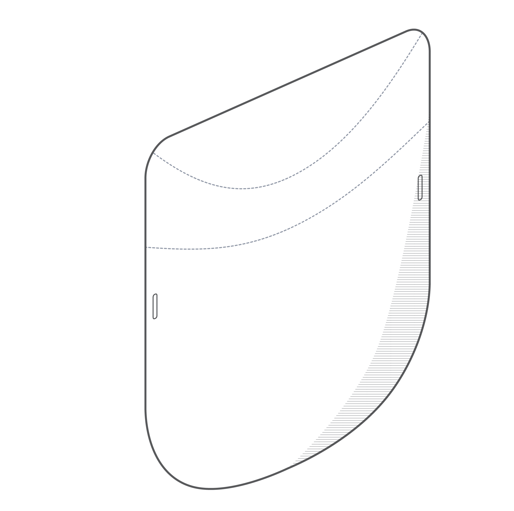

## Instructions

| Production Method                     | Tools | Materials | Web                                                                                                                          | Print | Video | Templates |
|---------------------------------------|-------|-----------|------------------------------------------------------------------------------------------------------------------------------|-------|-------|-----------|
| Manual Creasing: Straight Line Method |       |           |                                                                                                                              |       |       |           |
| Manual Creasing: Channel Method       |       |           | [<i class="em em-iphone" aria-role="presentation" aria-label="MOBILE PHONE"></i>](./pages/manual-creasing-straight-line/en/) |       |       |           |
| Lasercut + Soft Crease Press          |       |           |                                                                                                                              |       |       |           |
| Lasercut Only (Dashed Lines)          |       |           |                                                                                                                              |       |       |           |
| DIY Cardboard                         |       |           |                                                                                                                              |       |       |           |