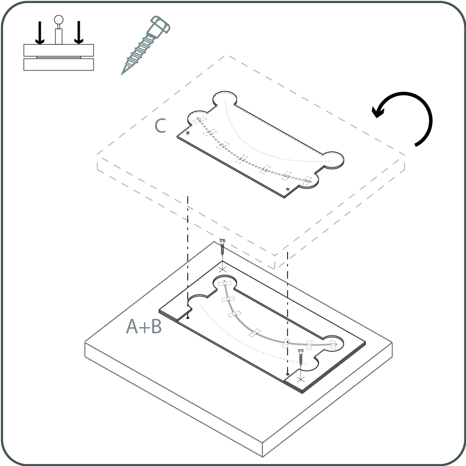
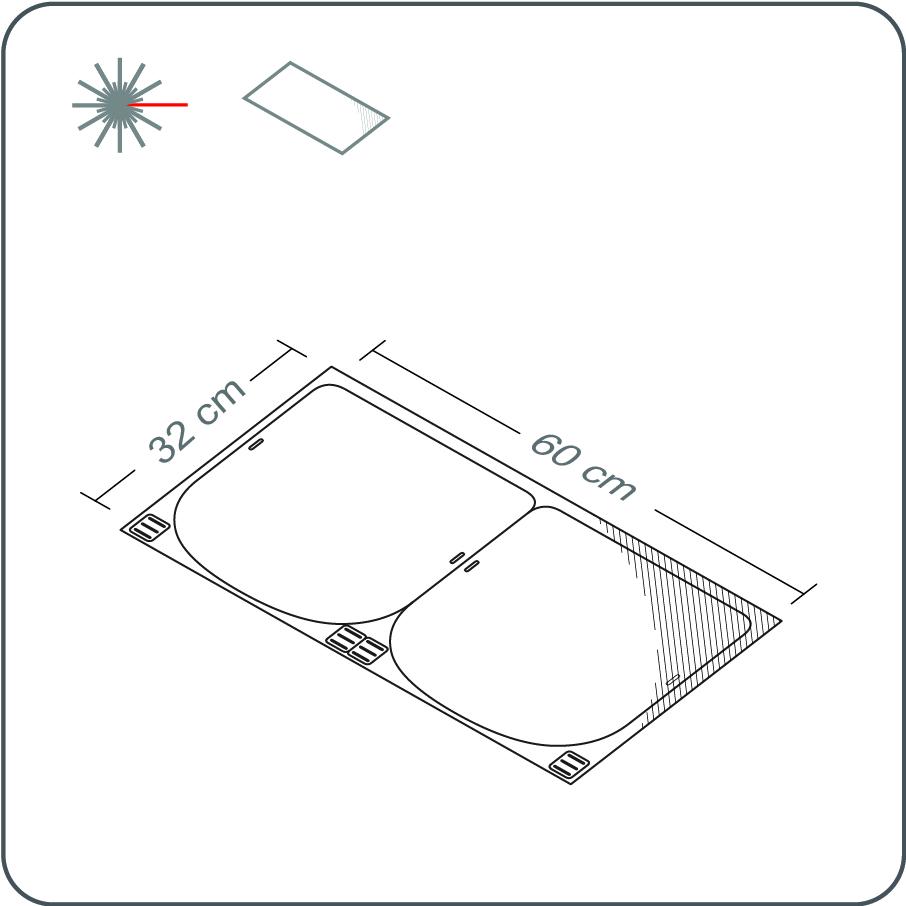
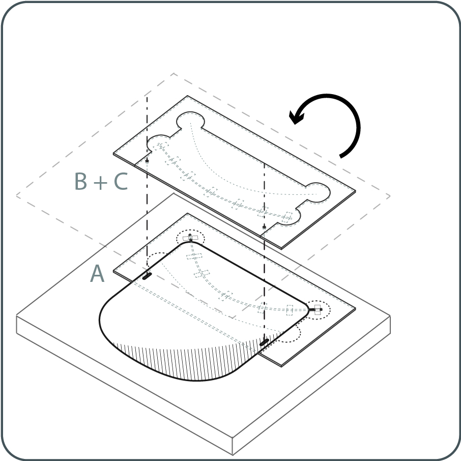
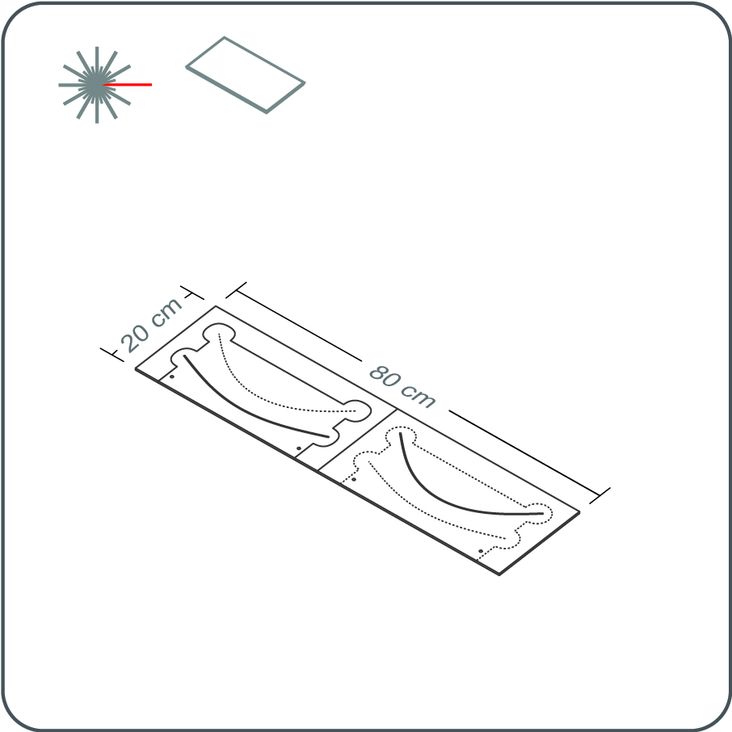
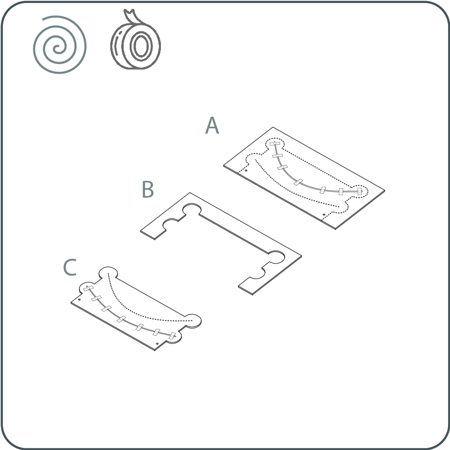
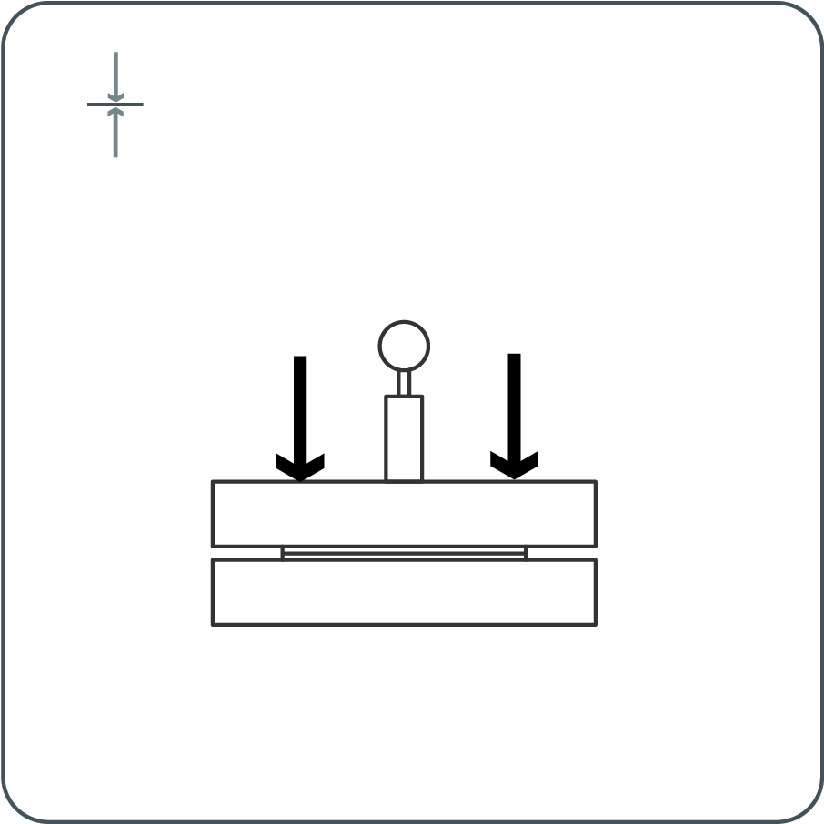
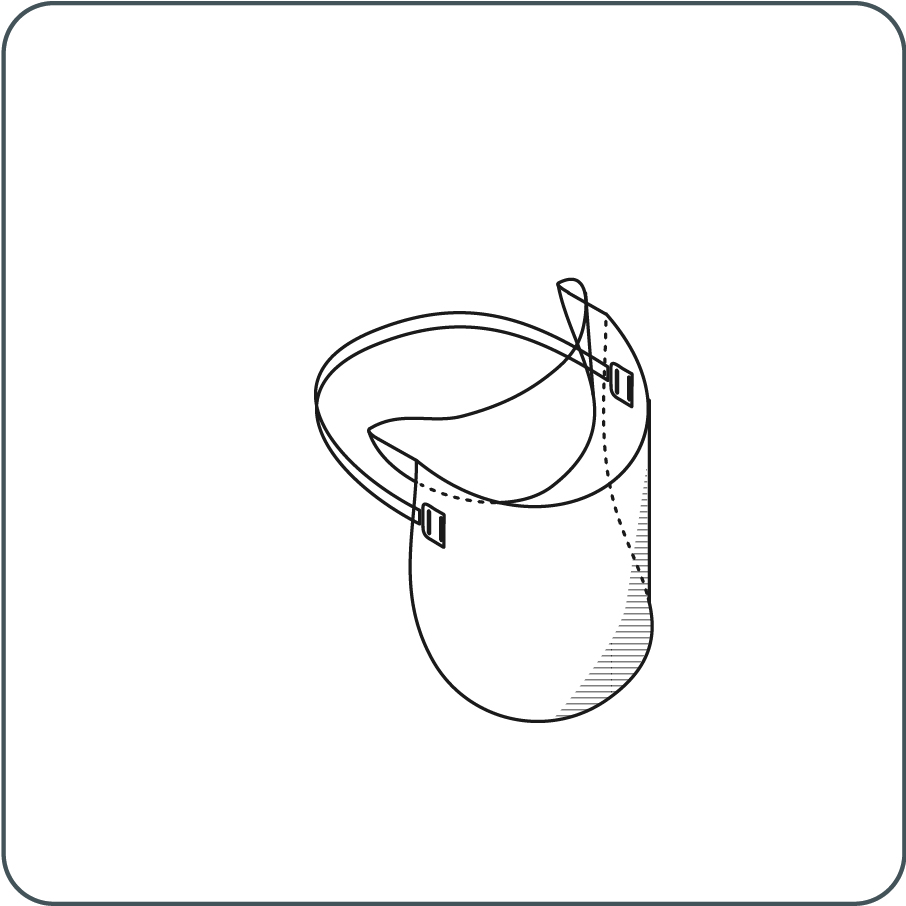

<iframe src="https://snapwidget.com/embed/810066" class="snapwidget-widget" allowtransparency="true" frameborder="0" scrolling="no" style="border:none; overflow:hidden;  width:100%; "></iframe>

---

## 3-Part Press Jig 

---

# 1 	

Download the laser-cutting template for the 3-part press jig which fits the bed of your laser-cutting machine. (The dimensions of the cutting templates are given in the filenames.) 
Choose any sheet material at least 4 mm deep with hardness similar to MDF or other wood, fibre, or plastic products for use in the jig. Laser-cut the sheet material using the template file, ensuring that your laser-cutter power and speed settings ensure a cut completely through the depth of the material.

---

# 2

Remove the 3 parts of the press jig from the laser-cutter. Select a metal wire between 1-3 mm in diameter. Cut the wire to the length of the dashed curves in parts A and C of the template.
Tape the metal wire onto the dashed curve the groove of the parts A and C of the press jig, being sure not to deviate from the dashed curve, and not to extend beyond the ends of the dashed curve. 

---

# 3

Attach Part B to top A using short wood screws, or any other method. Attach the combined Part A and B to a block as needed to distribute pressure evenly across the jig surface. Do the same for Part C.

--- 

## Shield

---

# 1

Download the HappyShield laser-cutting template which fits in the bed of your laser-cutting machine. (The dimensions of the cutting templates are given in the filenames.)

---

# 2	

Choose a flexible transparent sheet material for cutting. (These instructions have been tested for 0.5 mm PET and 0.5 mm acetate.) Laser-cut the sheet material using the template file, ensuring that your laser-cutter power and speed settings ensure a cut completely through the depth of the material.

Once cut, remove the resulting shields and friction clips from the laser-cutter bed. If desired, wipe the edges of the shields and clips with alcohol, or wash with any soap to remove any laser-cutting residues from the sheet. 

--- 

# 3

Insert shield into the 3-part press jig and press to create the curved creases.

---

# 4	

Cut a 400 mm length of elastic strap. Thread the strap through the friction clips on both ends.

---

# 5	

Pass the threaded friction clips through the holes in the shield from back to front. 